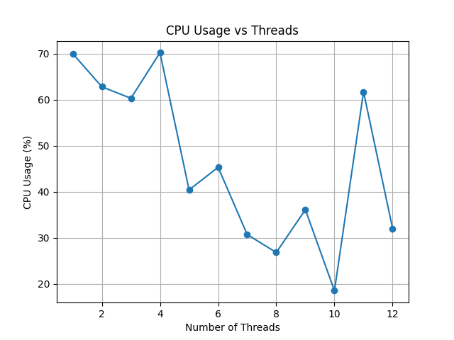

# Multi-Threaded Matrix Multiplication Performance Analysis

## Assignment Objective

This assignment evaluates the performance of **multi-threaded matrix multiplication** by multiplying random matrices with a constant matrix using different thread counts and analyzing:

- Execution Time
- CPU Usage
- Thread Performance

---

# System Configuration

| Parameter | Value |
|-----------|------|
| CPU Cores | 6 |
| Logical Processors | 12 |
| Max Threads | 12 |
| Matrix Size | 1000 × 1000 |
| Number of Matrices | 200 |
| Language | Python |
| Libraries | NumPy, Matplotlib, psutil |

---

# Methodology

## Step 1 — Matrix Generation

- Generate one **constant matrix**
- Generate **150 random matrices**
- Matrix size: **1000 × 1000**

```python
constant_matrix = np.random.rand(SIZE, SIZE)
matrices = [np.random.rand(SIZE, SIZE) for _ in range(NUM_MATRICES)]
```
## Step 2 — Multi-Threaded Multiplication

ThreadPoolExecutor is used to run multiplication using multiple threads.
ThreadPoolExecutor(max_workers=thread_count)

## Step 3 — Performance Measurement

For each thread count (1 to 12):

- Matrix multiplication is executed using multi-threading
- Execution time is recorded in minutes
- CPU usage is measured using `psutil`
- Results are stored for analysis
- Graphs are generated for:
  - Execution Time vs Threads
  - CPU Usage vs Threads

The experiment is repeated for different thread counts to analyze performance scalability.

---

## Result Table

| Threads | Time (Minutes) | CPU Usage (%) |
|---------|---------------|---------------|
| 1  | 0.223 | 70 |
| 2  | 0.156 | 63 |
| 3  | 0.136 | 60 |
| 4  | 0.125 | 70 |
| 5  | 0.152 | 40 |
| 6  | 0.145 | 45 |
| 7  | 0.160 | 30 |
| 8  | 0.136 | 27 |
| 9  | 0.131 | 36 |
| 10 | 0.168 | 18 |
| 11 | 0.212 | 61 |
| 12 | 0.254 | 32 |

## Graph 1 — Execution Time vs Threads

This graph illustrates how execution time varies with the number of threads used for matrix multiplication.


### Observations

- Execution time decreases initially as threads increase
- Minimum execution time observed around **4 threads**
- After 4–6 threads, execution time starts increasing
- This increase occurs due to:
  - Thread management overhead
  - Context switching
  - CPU resource contention

- Best performance achieved near **number of physical CPU cores**

---

## Graph 2 — CPU Usage vs Threads

This graph shows CPU utilization as the number of threads increases.



### Observations

- CPU usage is high for lower thread counts
- CPU usage fluctuates due to OS scheduling
- Maximum CPU utilization observed at:
  - 1 thread (~70%)
  - 4 threads (~70%)
- CPU usage decreases in mid-range threads due to:
  - Thread overhead
  - Resource sharing
- CPU usage increases again for higher thread counts

---

## Overall Observations

- Multi-threading improves performance initially
- Optimal performance occurs near **number of CPU cores**
- Increasing threads beyond optimal limit reduces performance
- CPU utilization fluctuates due to scheduling and thread overhead
- Threading overhead becomes significant at higher thread counts

---

## Conclusion

- Multi-threading significantly improves matrix multiplication performance
- Optimal performance achieved around **4–6 threads**
- Increasing threads beyond optimal value increases execution time
- CPU utilization varies depending on thread scheduling
- The experiment demonstrates that **optimal thread selection is important for efficient parallel computing**

This assignment successfully demonstrates the impact of **multi-threading on computational performance**.
